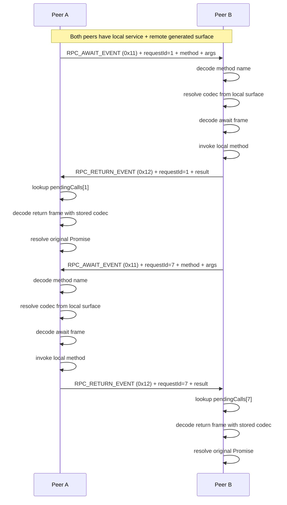

# nRPC Binary WebSocket Guide

This guide documents how to set up binary nRPC over WebSockets in this repository, including the special case where both sides act as peers and can call each other over the same socket.

It exists because the obvious runtime helpers are easy to misuse if you assume WebSocket transport behaves like the HTTP nRPC path.

## Scope

This guide covers:

- binary nRPC frames over a Bun WebSocket
- generated nRPC surfaces on both sides
- bidirectional peer calls over one persistent socket
- matching responses back to the originating outbound call

This guide does **not** describe:

- JSON WebSocket RPC
- ordinary HTTP `/rpc` usage
- synthetic `/api/*` route usage

## Important Version Caveat

In the `@nogg-aholic/nrpc` version currently installed in this workspace, the built-in WebSocket dispatcher is JSON-oriented.

The file below proves it:

- [node_modules/@nogg-aholic/nrpc/dist/service-ws-dispatcher.js](e:/LLM/apiRouter/n-router/node_modules/@nogg-aholic/nrpc/dist/service-ws-dispatcher.js)

It does `TextDecoder` plus `JSON.parse(...)` and is therefore **not** the correct handler for binary nRPC frames.

So for binary WebSocket RPC, do **not** use `handleRpcWebSocketMessage(...)` from the package in this version.

Instead, use the frame helpers directly.

## Required Building Blocks

For binary WebSocket transport, the core pieces are:

- generated surfaces on both sides
- `attachRpcCaller(...)`
- `createRpcCodecResolverFromSurface(...)`
- `encodeRpcAwaitMessageWithCodec(...)`
- `decodeRpcAwaitMethodName(...)`
- `decodeRpcAwaitMessageWithCodec(...)`
- `encodeRpcReturnMessageWithCodec(...)`
- `decodeRpcReturnMessageWithCodec(...)`

Those pieces give you:

- method-name metadata from the generated surface
- codec lookup from the generated surface
- binary await frame encoding
- binary await frame decoding
- binary return frame encoding
- binary return frame decoding

## Event Codes

Use the same event codes used across the nRPC providers in this repo:

- await event: `0x11`
- return event: `0x12`

These are already standardized in:

- [NRPC_PROVIDER_COMPATIBILITY_RULESET.md](e:/LLM/NRPC_PROVIDER_COMPATIBILITY_RULESET.md)

## Mental Model

Each side has two responsibilities.

### 1. Inbound server behavior

When a WebSocket message arrives and the first byte is the await event:

1. decode the method name from the frame
2. resolve the codec from the local generated surface
3. decode the full await message with that codec
4. invoke the local implementation
5. encode a return frame with the same request id
6. send the return frame back over the socket

### 2. Outbound client behavior

When a local generated method ref is called:

1. `attachRpcCaller(...)` intercepts the method ref invocation
2. method name is read from the ref metadata
3. codec is resolved from the remote generated surface
4. an await frame is encoded with request id + args
5. the frame is sent over the socket
6. a pending promise is stored by request id
7. when a matching return frame arrives, decode it with the same codec
8. resolve or reject the pending promise

That is the whole pattern.

## Why `createRpcCodecResolverFromSurface(...)` Matters

This is the important helper that avoids ad hoc guessing.

Use it to derive the codec resolver directly from the generated surface.

Example:

```ts
const localCodecResolver = createRpcCodecResolverFromSurface(localApi)
const remoteCodecResolver = createRpcCodecResolverFromSurface(remoteApi)
```

That ensures the method codec used for frame encoding and decoding comes from the same generated surface that defines the method refs.

Without this, people tend to start manually hardcoding method names or mixing codecs from the wrong side.

## Bidirectional Peer Pattern

This repo uses a special scenario:

- the main sidecar server can call the test client
- the test client can call the main sidecar server
- both use the same WebSocket connection

That means **both sides are simultaneously server and client**.

Each side therefore needs:

- a local service implementation
- a local codec resolver
- a remote generated surface
- a remote codec resolver
- a `pendingCalls` map keyed by request id
- a `message` handler that distinguishes await vs return frames

## Wire-Level Flow



## Minimal Binary WebSocket Template

### Shared constants

```ts
const RPC_AWAIT_EVENT = 0x11
const RPC_RETURN_EVENT = 0x12
```

### Local service

```ts
const service = {
  ping: {
    ping: async ({ message }: { message: string }) => {
      return { reply: `Pong: ${message}` }
    },
  },
}
```

### Local inbound invoker and codec resolver

```ts
const invokeMethod = createRpcMethodInvoker(service)
const localCodecResolver = createRpcCodecResolverFromSurface(localApi)
```

### Remote outbound surface binding

```ts
const remoteCodecResolver = createRpcCodecResolverFromSurface(remoteApi)

const pendingCalls = new Map<number, {
  codec: ReturnType<typeof getRpcMethodCodec>
  resolve: (payload: unknown) => void
  reject: (error: unknown) => void
}>()

let nextRequestId = 1

attachRpcCaller(remoteApi, async (methodRef, ...args) => {
  const methodName = getRpcMethodName(methodRef)
  if (!methodName) {
    throw new Error('Remote method ref is missing __nrpcMethodName metadata.')
  }

  const codec = getRpcMethodCodec(methodRef) ?? remoteCodecResolver(methodName)
  const requestId = nextRequestId++
  const frame = encodeRpcAwaitMessageWithCodec(
    RPC_AWAIT_EVENT,
    requestId,
    methodName,
    args,
    codec,
  )

  socket.send(frame as BufferSource)

  return new Promise((resolve, reject) => {
    pendingCalls.set(requestId, { codec, resolve, reject })
  }) as Promise<any>
})
```

### WebSocket message handler

```ts
socket.onmessage = async (event) => {
  const data = toUint8Array(event.data)
  const eventCode = data[0]

  if (eventCode === RPC_AWAIT_EVENT) {
    const methodName = decodeRpcAwaitMethodName(data, RPC_AWAIT_EVENT)
    const codec = localCodecResolver(methodName)
    const frame = decodeRpcAwaitMessageWithCodec(data, codec, RPC_AWAIT_EVENT)
    const args = Array.isArray(frame.args) ? frame.args : []

    try {
      const result = await invokeMethod(frame.methodName, args)
      const responseFrame = codec
        ? encodeRpcReturnMessageWithCodec(RPC_RETURN_EVENT, frame.requestId, true, result, codec)
        : encodeRpcReturnMessage(RPC_RETURN_EVENT, frame.requestId, true, result)
      socket.send(responseFrame as BufferSource)
    } catch (error) {
      const responseFrame = encodeRpcReturnMessage(
        RPC_RETURN_EVENT,
        frame.requestId,
        false,
        error instanceof Error ? error.message : 'rpc_error',
      )
      socket.send(responseFrame as BufferSource)
    }
  }

  if (eventCode === RPC_RETURN_EVENT) {
    const requestId = new DataView(data.buffer, data.byteOffset, data.byteLength).getUint32(1, false)
    const pending = pendingCalls.get(requestId)
    if (!pending) {
      return
    }

    pendingCalls.delete(requestId)
    const decoded = decodeRpcReturnMessageWithCodec(data, pending.codec, RPC_RETURN_EVENT)
    if (decoded.ok) {
      pending.resolve(decoded.payload)
    } else {
      pending.reject(decoded.payload)
    }
  }
}
```

## Why This Scenario Is Special

Most nRPC examples assume one of these:

- plain HTTP binary RPC
- synthetic HTTP routes
- JSON WebSocket messages

This scenario is different because:

- transport is WebSocket
- payload is binary nRPC, not JSON
- both ends can initiate calls
- both ends must keep state for in-flight request ids
- both ends must remember the codec associated with each request id

That last point is critical.

You cannot safely decode a return frame with the generic decoder when the result payload was codec-encoded. You must decode with the same codec associated with the original outbound call.

## Common Failure Modes

### 1. Using `handleRpcWebSocketMessage(...)`

Wrong for binary transport in this package version.

Reason:

- it decodes text
- it parses JSON

### 2. Wrapping WS messages in `Request`/`Response`

Possible as an experiment, but conceptually wrong for this peer-to-peer binary WS setup.

Reason:

- it hides the real request-id lifecycle
- it encourages treating WS like fake HTTP
- it adds confusion about where transport state actually lives

### 3. Manually hardcoding method strings

Avoid whenever possible.

Use generated surfaces plus:

- `attachRpcCaller(...)`
- `getRpcMethodName(...)`
- `createRpcCodecResolverFromSurface(...)`

### 4. Decoding return frames generically

Wrong when the payload was codec-encoded.

Use:

```ts
decodeRpcReturnMessageWithCodec(data, pending.codec, RPC_RETURN_EVENT)
```

### 5. Re-parsing the outbound buffer to rediscover metadata unnecessarily

Avoid using raw frame parsing as the source of truth for things the caller already knows.

The caller already knows:

- request id
- method name
- codec

Store those in the pending request table.

## Recommended Repo Pattern

For this repository, the cleanest pattern is:

1. Generate a surface for each peer.
2. Build one local codec resolver from the local surface.
3. Build one remote codec resolver from the remote surface.
4. Bind the remote surface with `attachRpcCaller(...)`.
5. Encode outbound await frames directly.
6. Decode inbound await frames directly.
7. Store pending outbound calls by request id plus codec.
8. Decode return frames with the stored codec.

## Current Example Files

The current concrete example lives in:

- [src/rpc-server.ts](e:/LLM/apiRouter/n-router/src/rpc-server.ts)
- [nrpc-test-client/src/index.ts](e:/LLM/apiRouter/n-router/nrpc-test-client/src/index.ts)
- [src/generated/api.contract.ts](e:/LLM/apiRouter/n-router/src/generated/api.contract.ts)
- [nrpc-test-client/src/generated/api.contract.ts](e:/LLM/apiRouter/n-router/nrpc-test-client/src/generated/api.contract.ts)

## Practical Rule Of Thumb

If the transport is binary WebSocket and both peers can initiate RPC calls, then think of it as:

- generated surfaces for method metadata
- codec resolvers from surfaces
- direct frame encode/decode
- explicit pending request bookkeeping

Do not think of it as:

- JSON RPC
- fake HTTP
- text messages with method strings hand-assembled ad hoc
